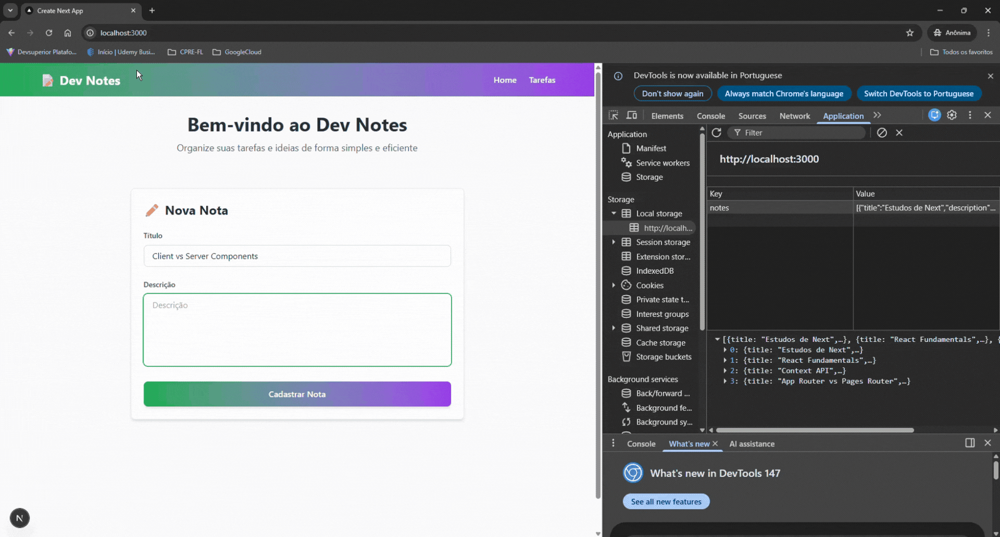

# 🧩 Mini Projeto (JavaScript): Dev Notes / Knowledge Tracker

## 🎯 Objetivo do Projeto

Criar uma aplicação simples em Next.js com App Router para praticar os fundamentos essenciais:

- **App Router** (estrutura moderna de rotas)
- **Pages** (rotas dinâmicas e estáticas)
- **Layouts** (compartilhamento de UI)
- **Server Components vs Client Components**
- **Context API** (gerenciamento de estado global)
- **Custom Hooks** (lógica reutilizável)
- **Local Storage** (persistência de dados)

---
## Demonstração




## 📦 Escopo

### O que a aplicação faz

- ✅ Exibe uma lista de anotações técnicas
- ✅ Permite visualizar o detalhe de uma anotação
- ✅ Possui um formulário simples para criar novas anotações
- ✅ Organização por rotas (URL)
- ✅ Marca tarefas como concluídas
- ✅ Remove anotações
- ✅ Persiste dados no Local Storage

---

## 🛠️ Tecnologias e Conceitos Praticados

### Next.js App Router
- Estrutura de pastas `app/`
- Rotas dinâmicas: `[slug]/page.js`
- Navegação com `Link` e `useRouter`

### React Fundamentals
- **Server Components**: `app/page.js` (padrão)
- **Client Components**: `"use client"` para interatividade
- **Context API**: `NotesContext` para estado global
- **Custom Hook**: `useNotes` para lógica de negócio

### State Management
- `useState` para estado local
- `useEffect` para sincronização com Local Storage
- `useContext` para consumir contexto global

### Persistência
- Local Storage para salvar notas
- Sincronização automática entre componentes

---

## 📁 Estrutura do Projeto

```
app/
├── components/          # Componentes reutilizáveis
│   ├── Header.js
│   ├── NoteCard.js
│   ├── NoteDetails.js
│   ├── NoteForm.js
│   └── NotesList.js
├── context/            # Context API
│   └── NotesContext.js
├── hooks/              # Custom Hooks
│   └── useNotes.js
├── notes/              # Rotas de notas
│   ├── page.js         # Lista de notas
│   └── [slug]/         # Rota dinâmica
│       └── page.js     # Detalhe da nota
├── layout.js           # Layout global
├── page.js             # Página inicial
└── globals.css         # Estilos globais
```

---

## 🚀 Como Executar

1. **Instalar dependências:**
```bash
npm install
```

2. **Executar o servidor de desenvolvimento:**
```bash
npm run dev
```

3. **Abrir no navegador:**
```
http://localhost:3000
```

---

## 📚 Principais Aprendizados

### 1. App Router vs Pages Router
- Estrutura baseada em pastas
- Server Components por padrão
- Layouts compartilhados

### 2. Client vs Server Components
- Server Components: renderização no servidor, sem JavaScript no cliente
- Client Components: interatividade, hooks, eventos

### 3. Context API
- Compartilhar estado entre componentes
- Evitar prop drilling
- Provider pattern

### 4. Custom Hooks
- Extrair lógica reutilizável
- Separar concerns
- Facilitar testes

### 5. Local Storage
- Persistência de dados no navegador
- Sincronização com `useEffect`
- Serialização JSON

---

## 📝 Notas

Este é um projeto educacional focado em praticar conceitos fundamentais do Next.js e React. O código prioriza clareza e simplicidade sobre otimização e features avançadas.
